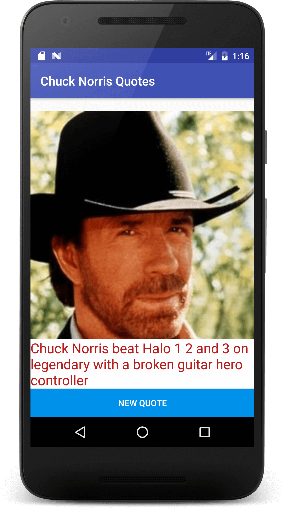

# java-stuff
just java stuff ...

### App todo:
+ might need to **change API** (some jokes have mispellings, to say the least)
+ should add ripple animation on button

### App description
App starts with a joke, you can get a new one by pressing on the button, and if you have an internet connection, it will fetch a new joke ([api.chucknorris.io](https://api.chucknorris.io/)), and will display it.

### App screen
