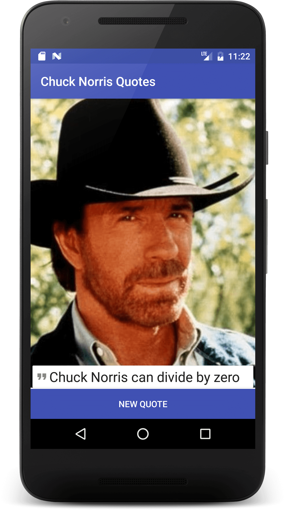

# java-stuff
just java stuff ...

## Chuck Norris quotes app

### App description
App starts with a joke, you can get a new one by pressing on the button, and if you have an internet connection, it will fetch a new joke ([api.chucknorris.io](https://api.chucknorris.io/)), and will display it.

### TODO
+ might need to **change API** (some jokes have mispellings, to say the least)
+ should add **ripple animation** on button
+ refactor the part with `StrictMode.ThreadPolicy policy`

### App features
+ used `java.net.HttpURLConnection` to load new quotes from the API ([MainActivity.java](https://github.com/xR86/java-stuff/blob/master/Android-ChuckNorrisQuotes/app/src/main/java/com/xr86/chucknorrisquotes/MainActivity.java))
+ used a `RelativeLayout` ([activity_main.xml](https://github.com/xR86/java-stuff/blob/master/Android-ChuckNorrisQuotes/app/src/main/res/layout/activity_main.xml)), alongside [strings.xml](https://github.com/xR86/java-stuff/blob/master/Android-ChuckNorrisQuotes/app/src/main/res/values/strings.xml)

### App screen
