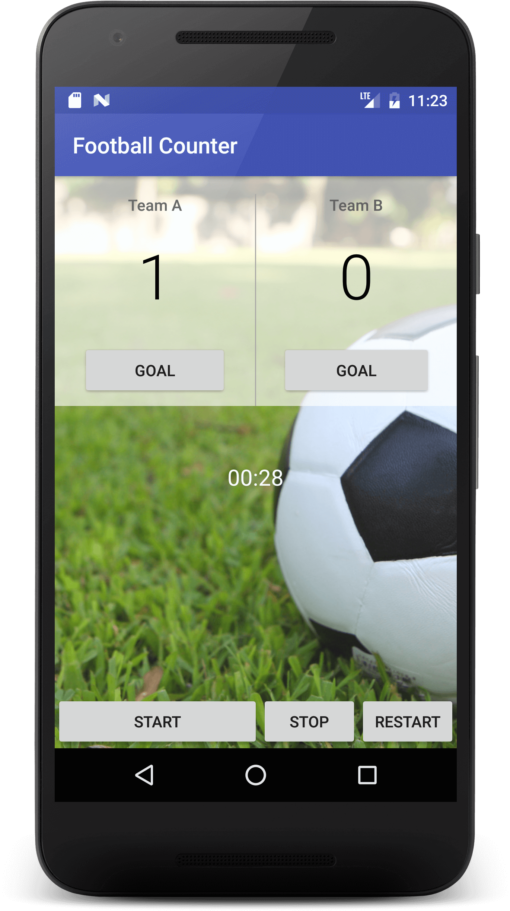

# java-stuff
just java stuff ...

## Court Counter app

### App description
Simple football counter.

### TODO
+ display number for minute
+ `EditText` with autocomplete API for player name
+ reset button for the scores
+ fix `chronometer` (starts before `onClick`, doesn't stop ...)
+ update interface

### App features
+ score for team A and team B ([activity_main.xml](https://github.com/xR86/java-stuff/blob/master/Android-CourtCounter/app/src/main/res/layout/activity_main.xml))
+ counter for time ([MainActivity.java](https://github.com/xR86/java-stuff/blob/master/Android-CourtCounter/app/src/main/java/io/github/xr86/courtcounter/MainActivity.java))

### App screen
