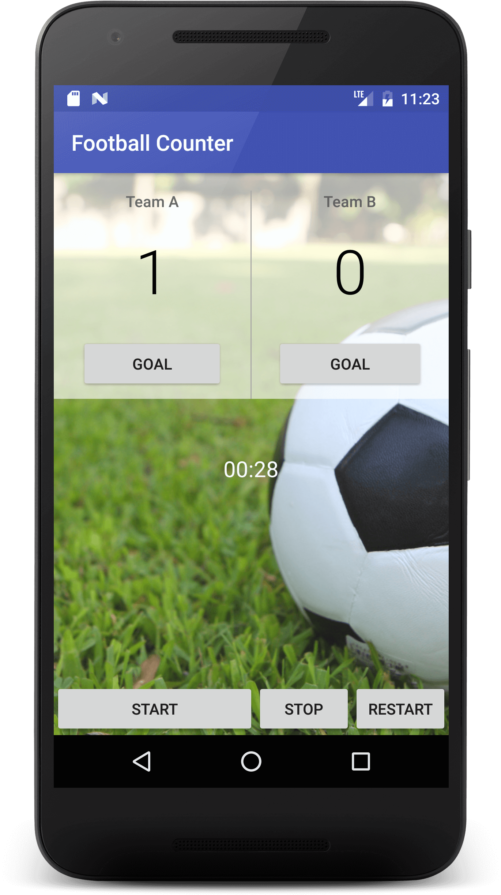

# java-stuff
just java stuff ...

## Court Counter app

### App description
Simple football counter.

**TODO**:
+ display number for minute
+ EditText with autocomplete API for player name
+ reset button for the scores
+ fix chronometer (starts before onClick, doesn't stop ...)
+ update interface

### App screen
