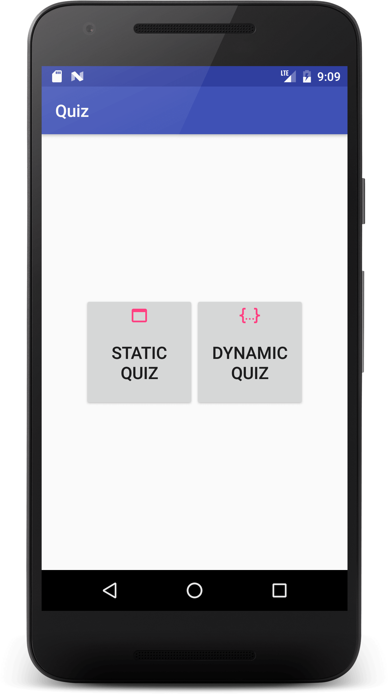
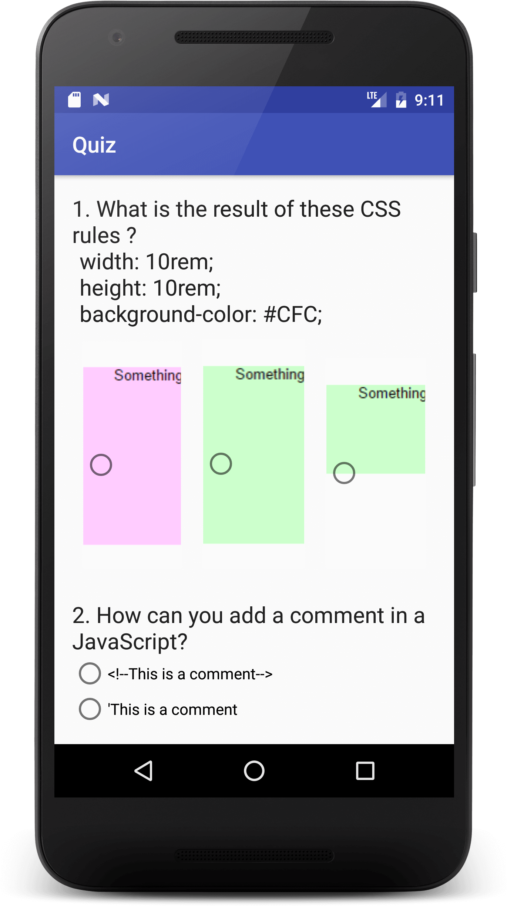
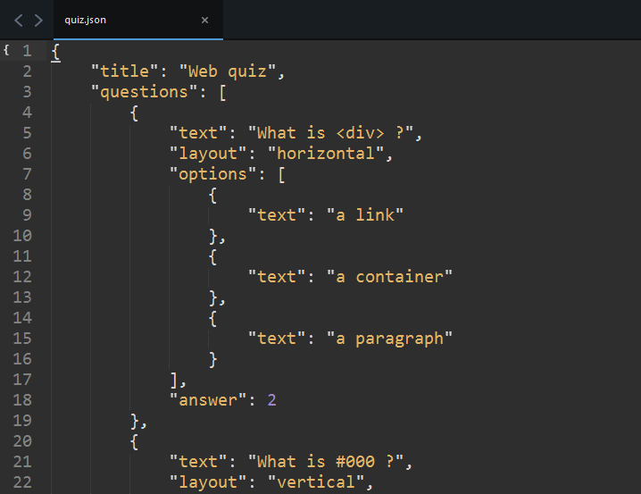
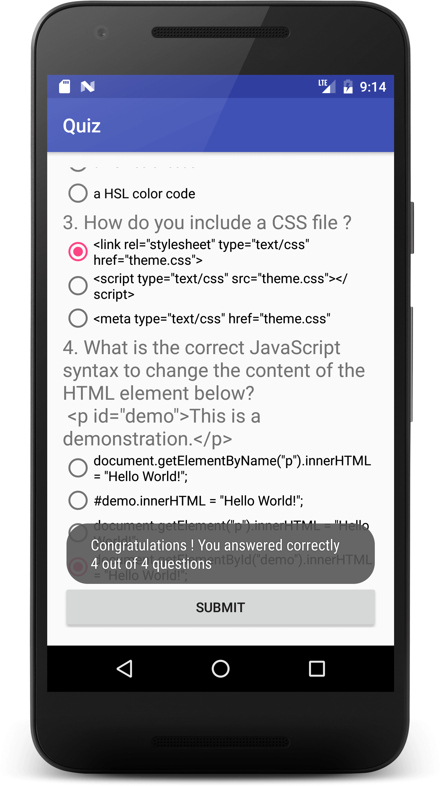

# java-stuff
just java stuff ...

## Quiz app

### App description
Static and dynamic Web quiz.

### TODO
+ add syntax highlighting element for code portion
+ refactor question `TextView` to `LinearLayout` (to not break scoring, and allow for separate elements - such as question and code)
+ globally set function signatures (for example avoiding using conditional  function signatures inline: `if (Build.VERSION.SDK_INT < 23)` for `setTextAppearance`)

### App features
+ main screen, where you can access either the static or the dynamic quiz ([activity_main.xml](https://github.com/xR86/java-stuff/blob/master/Android-Quiz/app/src/main/res/layout/activity_main.xml), [MainActivity.java](https://github.com/xR86/java-stuff/blob/master/Android-Quiz/app/src/main/java/io/github/xr86/quiz/MainActivity.java))
+ custom icons for the main screen ([res/drawable](https://github.com/xR86/java-stuff/tree/master/Android-Quiz/app/src/main/res/drawable) - `ic_c` files)
+ styles for elements ([styles.xml](https://github.com/xR86/java-stuff/blob/master/Android-Quiz/app/src/main/res/values/styles.xml))
+ static quiz - hardcoded `ScrollView` layout (as per project specs from Udacity; [activity_static.xml](https://github.com/xR86/java-stuff/blob/master/Android-Quiz/app/src/main/res/layout/activity_static.xml), [StaticActivity.java](https://github.com/xR86/java-stuff/blob/master/Android-Quiz/app/src/main/java/io/github/xr86/quiz/StaticActivity.java))
  + radio button quiz (single solution)
  + radio button with `ImageView`
  + `toast` to conditionally display a message with the result
+ dynamic quiz - `ScrollView` layout and scoring based on a json configuration file ([quiz.json](https://github.com/xR86/java-stuff/blob/master/Android-Quiz/app/src/main/res/raw/quiz.json), [activity_dynamic.xml](https://github.com/xR86/java-stuff/blob/master/Android-Quiz/app/src/main/res/layout/activity_dynamic.xml), [DynamicActivity.java](https://github.com/xR86/java-stuff/blob/master/Android-Quiz/app/src/main/java/io/github/xr86/quiz/DynamicActivity.java))
  + questions, options and answer specified in the config
  + `RadioGroup` layout defined in the config
  + `toast` to conditionally display a message with the result

### App screens

> Main screen

> static screen

> json configuration file

> dynamic screen

https://stackoverflow.com/questions/39535475/what-is-the-default-font-family-in-android
