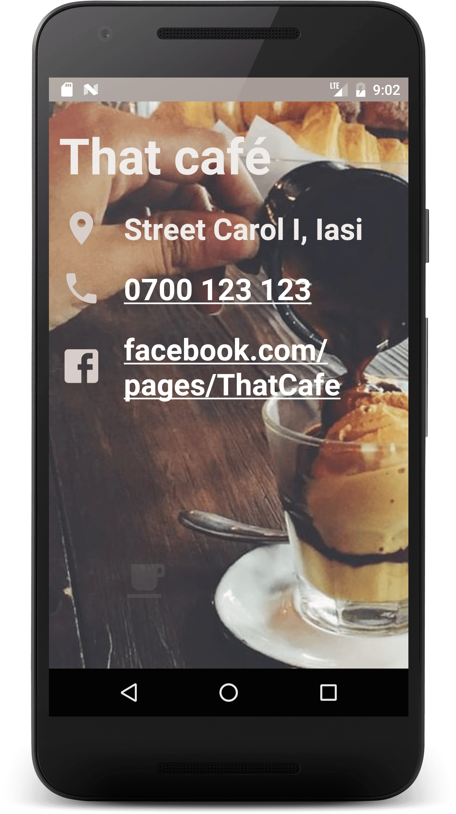

# java-stuff
just java stuff ...

## Single Screen app

### App description
Simple presentation app.

### App features
+ custom material pallette for the theme ([colors.xml](https://github.com/xR86/java-stuff/blob/master/Android-SingleScreen/app/src/main/res/values/colors.xml))
+ custom icon for the app ([updated_coffee_cup.xml](https://github.com/xR86/java-stuff/blob/master/Android-SingleScreen/app/src/main/res/drawable/updated_coffee_cup.xml))
+ autolink on phone and web address ([activity_main.xml](https://github.com/xR86/java-stuff/blob/master/Android-SingleScreen/app/src/main/res/layout/activity_main.xml))
+ animation when pressing on the coffee ([hyperspace_jump.xml](https://github.com/xR86/java-stuff/blob/master/Android-SingleScreen/app/src/main/res/anim/hyperspace_jump.xml))

### App screen
