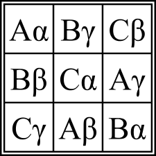

# java-stuff
Advanced Programming Lab Homeworks

## Notes:
+ windows by default can't display unicode characters (ref: [stack-1](http://stackoverflow.com/a/6168866/6139015) - references [i18n: Unicode at Windows command prompt](https://illegalargumentexception.blogspot.ro/2009/04/i18n-unicode-at-windows-command-prompt.html#charsets_1252), [stack-2](https://stackoverflow.com/questions/388490/unicode-characters-in-windows-command-line-how) - not recommended workaround )

**Dan's notes** (`LatinSquare.java`):
+ ...

**Luca's notes** (`Lab12.java`):
+ We have generation through rotation and MOLS. We also included a function that uses rotation to obtain the square from the example).
+ For argument parsing we have:
  + the case where `N` is missing and we choose it randomly in main
  + the case where only `N` is provided, so we fill the array with the first `N` latin and greek characters
  + the case where `N`, and the `S` and `T` arrays are provided
+ sadly, we don't have the backtracking generation

### Lab description

Write a Java application that generates and prints on the screen Graeco-Latin squares. A Graeco-Latin Square is a n x n matrix. Each cell of the matrix is a pair of elements taken from the carthesian product of two given sets: S X T; for example, S may be a subset of the Latin alphabet and T a subset of the Greek alphabet.

The constraints are:
+ In each row, and in each column, all the 2n elements are different.
+ No two pairs are the same in the matrix.

Example:  

The main specifications of the application are:

+ Create and display the square from the example. The Unicode character for α is "\u03B1".
+ Parse the command line arguments - they are given in the following format: 
  + [n:number of elements] [S:"elements of the first set"] [T:"elements of the second set"]
If command line arguments are missing, the application will generate a random value for n, S contains the first n characters of the Latin alphabet (upper case) and T the first n characters of the Greek alphabet (lower case).
+ Generate Graeco-Latin squares of size n x n and display them on the screen:
+ at least one...
+ all of them (display only the first, count them instead).
The running time of the application will be displayed on the screen (try n=5).