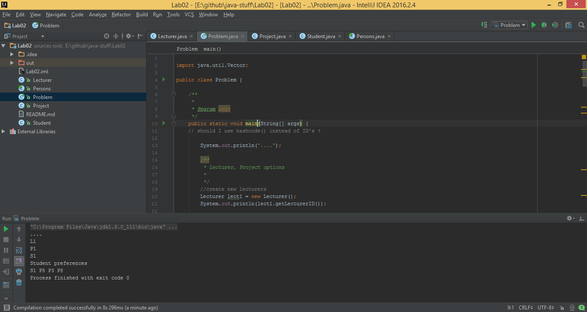

# java-stuff
Advanced Programming Lab Homeworks

## Notes:
+ main class: `Problem`

### Lab description
The Student-Project Allocation Problem (SPA) 
An instance of SPA involves a set of **students**, **projects** and **lecturers**. Each project is offered by a unique lecturer and has a capacity constraint (an upper bound regarding how many students can be enrolled). 
Each lecturer has also a capacity constraint regarding how many students is he/she willing to supervise. 
A student may be enrolled in at most one project. Each student has a preferences list over the available projects that he/she finds acceptable, whilst a lecturer will normally have preferences over the students that he/she is willing to supervise.

We consider the problem of allocating students to projects based on these preference lists and capacity constraints, the so-called Student-Project Allocation problem (SPA).

The main specifications of the application are:
+ Create an object-oriented model of the problem. You should have at least the following classes: `Student`, `Lecturer`, `Project`, `Problem`. 
+ Each class should have appropriate constructors, setters and getters. The `toString` and `equals` methods form the `Object` class must be properly overridden. Note that both a student and a lecturer are persons, having various properties specific to humans, like: name, email, etc. You should consider creating a superclass for them. This superclass should have the abstract method `isFree` (a student is free if it has no project, a lecturer is free if its capacity has not been reached).
+ Create and print on the screen the instance of the problem described in the example.
+ Implement an algorithm for allocating students to projects, subject to the preferences and capacities. The solution should be a **matching** between students and projects. Consider creating a class to describe such a matching. Analyse how "good" is this matching from the students or lecturers point of views. 
A bonus may be awarded if you implement an algorithm to generate a stable matching, as described in the article.
+ Write doc comments in your source code and generate the class documentation using javadoc