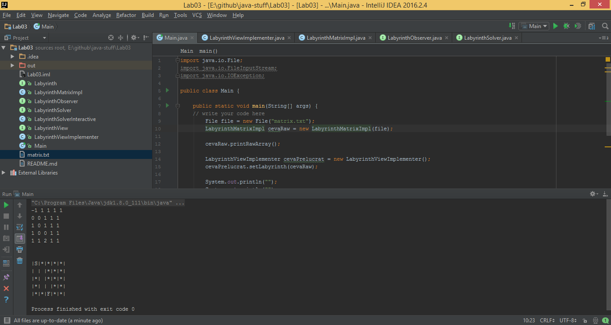

# java-stuff
Advanced Programming Lab Homeworks

## Notes:
+ main class: `Main`

<a href="screen.png"></a>

### Lab description

**Labyrinth**  
Write an application that allows creating and solving labyrinths. A *labyrinth* is a matrix whose cells may be *free (rooms)* or *occupied (walls)*, having a *start cell* and a *finish cell*. 
A solution is represented by a sequence of movements of types: **U(p)**, **D(own)**, **L(eft)**, **R(ight)** identifying a path from the start cell to the finish.

Example of a matrix representing a labyrinth:
```
-1 1 1 1 1
 0 0 1 1 1
 1 0 1 1 1
 1 0 0 1 1
 1 1 2 1 1 
```
`-1(start),2(finish),0(free),1(wall).`
+ Create the interface `Labyrinth` responsible with describing the model (content) of a labyrinth. The methods of the interface should be: getRowCount, getColumnCount, isFreeAt, isWallAt, getStartCell, getFinishCell,... 
+ Create two implementations of this interface:
  + `LabyrinthMatrixImpl` that uses a 2-dimensional array for representing the data;
  + `LabyrinthListImpl` that represents the content as the list of occupied cells, in order to accomodate very large sparse labyrinths.
+ Create the interface `LabyrinthView` responsible with describing the text representation of a labyrinth. It should containt the methods: `get/setLabyrinth`, `toString`, .... 
Create at least one implementations of this interface.
Example of a text representation:
```
 |S|*|*|*|*|
 | | |*|*|*|
 |*| |*|*|*|
 |*| | |*|*|
 |*|*|F|*|*|
 ```
+ Create the interface `LabyrinthSolver` responsible with describing the exploration of an labyrinth. It should contain the methods: `get/setLabyrinth`, `nextCellToExplore`, .... Create at least two implementations of this interface:
  + Interactive, reading the movements from the keyboard.
  + Automated, using a DFS, BFS, etc. algorithm.
 The solution for the above labyrinth: D,R,D,D,R,D.
```
 |S|*|*|*|*|
 |X|X|*|*|*|
 |*|X|*|*|*|
 |*|X|X|*|*|
 |*|*|F|*|*|
```
+ Create the interface `LabyrinthObserver` that describes an observer of the labyrinth exploration. Whenever the exploration has reached a certain cell or it has identified a solution, the solver will invoke all the associated observers. 
It should contain the methods: `processCell`, `processSolution`, .... 
Implement at least two observers:
+ One observer will print on the screen information during the exploration.
+ One observer will store the solutions found by the exploration in a data structure sorted by the length of the solution.