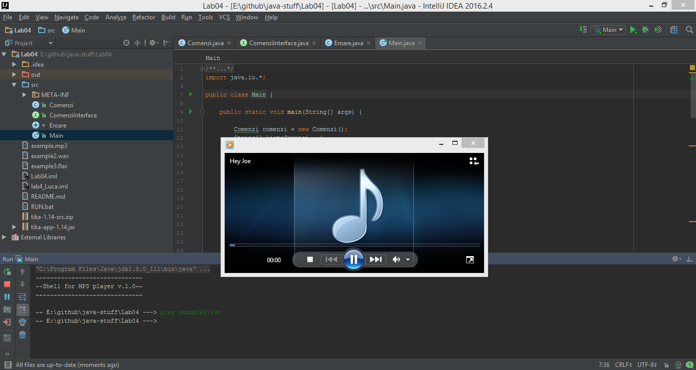

# java-stuff
Advanced Programming Lab Homeworks

## Notes:
+ download jar from [http://www-us.apache.org/tika-app-1.14.jar](http://www-us.apache.org/dist/tika/tika-app-1.14.jar)
+ main class: `Main`

### Lab description

Starting from this week...:
+ Pay attention to exception handling
+ Create your own types of exceptions to report abnormal events related to application execution.

**Audio Library Manager**  
Write a program to simulate a 'shell' for working with audio files: MP3, FLAC, WAV, etc. The application must provide (in an easily extensible manner!) different commands such as:
+ `cd`: setting the current directory ("current directory" is a notion relative to the application);
+ `list`: listing of the audio files in a specific directory or in the current directory;
+ `play`: playback of a file using the native operating system application (see the Desktop class);
+ `info`: display the metadata of a specific file: songname, artist, album, year, etc. (you may want to use Apache Tika or something similar).
+ `find`: search for a song having a particular name, or artist, or album. etc (use regular expressions); the search will be done starting with the current directory and recursively into its subfolders.
+ `fav`: add a specific file to the favorites list, stored in a file (plain text or using serialization).
+ `report`: create a report (text, html, pdf, xls, etc.) containing the favorite songs 

A bonus may be given for using either:
+ A template engine such as FreeMarker or Velocity, in order to create an HTML report.
+ A report designer such as Dynamic Reports. in order to create PDF reports.
+ Apache POI in order to create Microsoft Documents (Word, Excel, etc).

The commands will be read from the keyboard, together with their arguments. The application will signal the commands that are not valid using custom exceptions. 
The final form of the application will be an executable JAR archive.