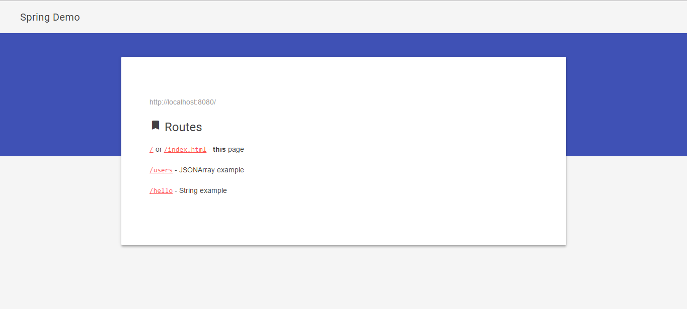
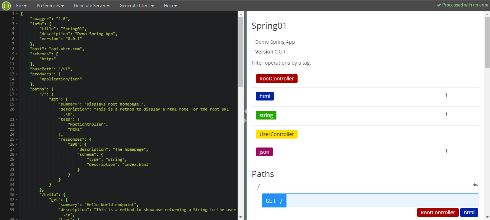

# java-stuff
just java stuff ...

### Simple Spring MVC App (used [Spring Initializr](http://start.spring.io/) and Spring Boot)

### Documentation in `_docs/`:
+ **javadoc** - written, but not generated yet
+ **swagger** - just copy & paste the swagger yaml or json in [editor.swagger.io](http://editor.swagger.io/#/), should look like this

### TODO:

+ folder structure - organize on modules vs organize on components (`controllers/` ...)
+ livereload (on `public/` files change)
+ automate swagger documentation - https://blog.zenika.com/2013/07/11/documenting-a-rest-api-with-swagger-and-spring-mvc/
+ db connection
+ endpoint for Android app - eg: barcode scanner with [ZXing](https://stackoverflow.com/questions/8009309/how-to-create-barcode-scanner-android), that fetches data from an id on this endpoint, and displays it to the user
+ automatically build a Spring Boot jar in `binaries/` folder on `make`
